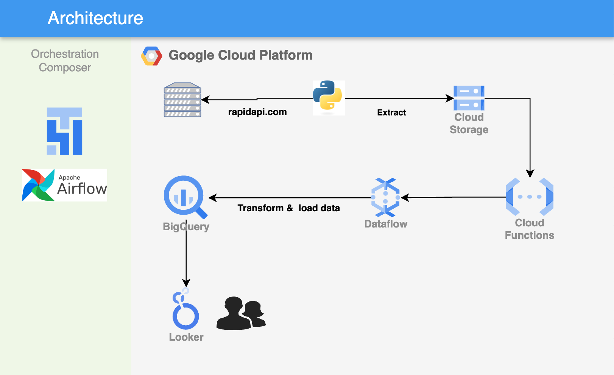

# Cricbuzz Rankings → BigQuery

Event-driven pipeline that pulls T20 batsmen rankings from the Cricbuzz API (via RapidAPI) and lands them in BigQuery, with no polling: a file arriving in GCS is what fires the load.



## How it works

1. **Extract** (`extract_and_push_gcs.py`) — calls the Cricbuzz API, writes the response to `batsmen_rankings.csv`, uploads it to a GCS bucket. Scheduled by Cloud Composer / Airflow (`dag_extract_and_push_gcs.py`).
2. **Trigger** (`trigger_dataflow.py`) — a Cloud Function subscribed to the bucket's `google.storage.object.finalize` event. When the CSV lands, it launches a Dataflow job from Google's `GCS_Text_to_BigQuery` template.
3. **Transform + Load** — Dataflow applies a JavaScript UDF (`udf.js`) that parses each CSV line into a JSON object matching the BigQuery schema (`bq.json`), then loads it into `batsmen_rankings`.

```
Cricbuzz API → extract_and_push_gcs.py → GCS bucket
                                              │ (object finalize event)
                                              ▼
                                     trigger_dataflow.py (Cloud Function)
                                              │
                                              ▼
                              Dataflow (GCS_Text_to_BigQuery template + UDF)
                                              │
                                              ▼
                                       BigQuery: batsmen_rankings
```

## Why this pattern

No cron job polls GCS for new files — the bucket itself notifies the Cloud Function the moment a file finalizes, which fires Dataflow. This keeps the pipeline reactive and avoids paying for idle polling.

## Running it

```bash
pip install -r requirements.txt

export RAPIDAPI_KEY=your_rapidapi_key
export GCP_PROJECT_ID=your-gcp-project-id
python extract_and_push_gcs.py

# once a file lands in GCS, trigger_dataflow.py fires automatically as a
# Cloud Function; to fire it manually during local testing:
python trigger_dataflow_local.py
```

Deploy `trigger_dataflow.py` as a Cloud Function with a GCS finalize trigger on the target bucket, and `dag_extract_and_push_gcs.py` to Cloud Composer for the daily schedule.

## Stack

Cricbuzz API (RapidAPI) · Cloud Composer / Airflow · Google Cloud Storage · Cloud Functions · Dataflow (Apache Beam) · BigQuery
