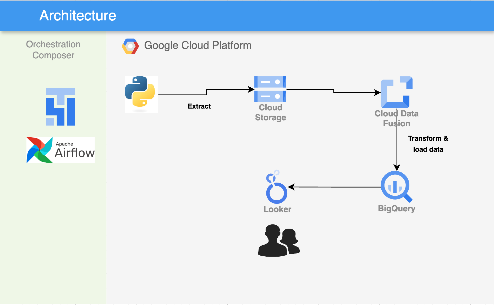

# Employee Data → Cloud Data Fusion → BigQuery

Airflow-orchestrated ETL that generates a synthetic employee dataset, lands it in GCS, and hands it off to Cloud Data Fusion for a no-code transform into BigQuery — a pattern for teams that want a visual ETL layer instead of hand-written SQL/Spark for every pipeline.



## How it works

1. **Extract** (`extract.py`) — generates a synthetic employee dataset with [Faker](https://faker.readthedocs.io/), writes it to CSV, uploads it to GCS.
2. **Orchestrate** (`dag_employee_data_pipeline.py`) — an Airflow DAG runs the extract script, then triggers a named Cloud Data Fusion pipeline via `CloudDataFusionStartPipelineOperator`.
3. **Transform + Load** — Data Fusion (a managed, visually-designed ETL pipeline) reads the CSV from GCS and loads it into BigQuery.

```
extract.py (Faker) → GCS → Airflow DAG → Cloud Data Fusion pipeline → BigQuery
```

## Running it

```bash
pip install -r requirements.txt

export GOOGLE_APPLICATION_CREDENTIALS=/path/to/service-account.json  # extract_local.py only
python extract.py       # runtime credentials (Composer/ADC)
# or
python extract_local.py # explicit local service account key
```

Deploy `dag_employee_data_pipeline.py` to Cloud Composer with a `gcp` connection configured, and a Data Fusion instance/pipeline named `datapipeline` / `employee_data`.

## Stack

Faker · Google Cloud Storage · Cloud Composer / Airflow · Cloud Data Fusion · BigQuery
