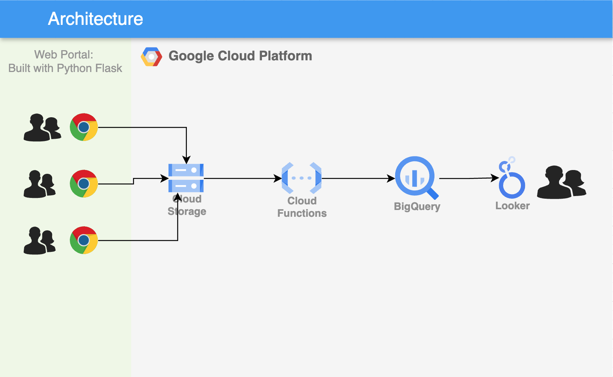

# Browser Upload → GCS → BigQuery

A minimal web form for non-technical users to drop a CSV straight into a BigQuery table — useful when the data source is a one-off export someone needs to hand off, not an API worth automating.



## How it works

1. **Upload** (`main.py`, Flask) — serves an upload form (`templates/index.html`) and pushes the submitted file to GCS.
2. **Trigger + Load** (`functions.py`) — a Cloud Function fires on the GCS object-finalize event and loads the CSV into BigQuery (`temp.orders_ecommerce`) with schema autodetection.

```
Browser → Flask upload form → GCS bucket
                                   │ (object finalize event)
                                   ▼
                        functions.py (Cloud Function)
                                   │
                                   ▼
                    BigQuery: temp.orders_ecommerce
```

Sample e-commerce order data is included in `data/ecommerce_data.zip` for testing the upload end to end.

## Running it

```bash
pip install -r requirements.txt
python main.py
```

Open `http://localhost:5000`, pick a CSV, upload. Deploy `functions.py` separately as a Cloud Function with a GCS finalize trigger on the same bucket.

## Stack

Flask · Google Cloud Storage · Cloud Functions · BigQuery
