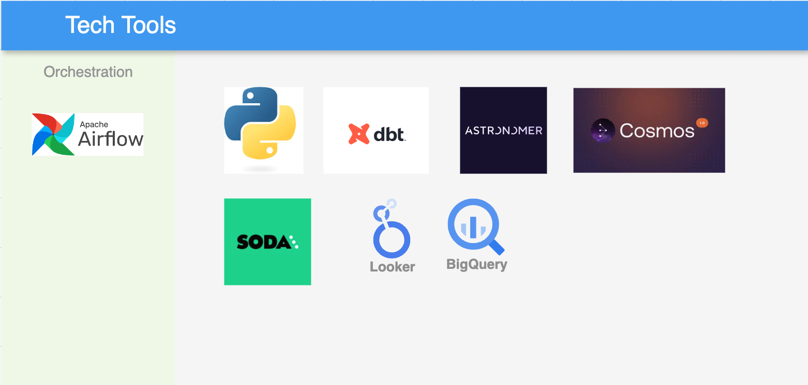
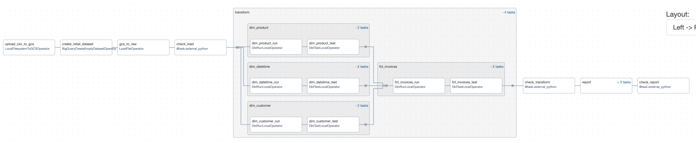

# Retail Analytics: Airflow + dbt + Soda

An end-to-end analytics pipeline on the [Online Retail](https://archive.ics.uci.edu/dataset/352/online+retail) dataset: raw invoices land in BigQuery, dbt (via [Cosmos](https://astronomer.github.io/astronomer-cosmos/)) builds a star schema on top, and [Soda](https://www.soda.io/) gates every stage on data-quality checks — so a bad transform fails the DAG instead of quietly reaching a report.



## How it works

```
CSV → GCS → raw_invoices (BigQuery)
                  │
                  ▼
            Soda check: source
                  │
                  ▼
   dbt (Cosmos task group): dim_customer, dim_product,
   dim_datetime, fct_invoices
                  │
                  ▼
           Soda check: transform
                  │
                  ▼
   dbt (Cosmos task group): report_customer_invoices,
   report_product_invoices, report_year_invoices
                  │
                  ▼
            Soda check: report
```



1. **Load** — `LocalFilesystemToGCSOperator` uploads `include/dataset/online_retail.csv` to GCS; `astro.sql.load_file` loads it into `retail.raw_invoices`.
2. **Check** — a Soda scan validates the raw table against `include/soda/checks/sources/raw_invoices.yml` before anything downstream runs.
3. **Transform** — dbt builds a star schema: `dim_customer`, `dim_product`, `dim_datetime`, and `fct_invoices` (see `include/dbt/models/transform/`), run as a native Airflow task group via Cosmos rather than a single opaque `dbt run` step.
4. **Check** — another Soda scan validates the star schema.
5. **Report** — dbt builds three reporting marts: revenue by country, top products by quantity sold, and monthly revenue trend (`include/dbt/models/report/`).
6. **Check** — a final Soda scan validates the reports before the DAG completes.

Each Soda check is a real DAG dependency (`chain(...)` in `dags/retail.py`) — a failed check stops the pipeline instead of just logging a warning.

## Running it

Requires the [Astro CLI](https://www.astronomer.io/docs/astro/cli/overview).

```bash
astro dev start
```

Then in the Airflow UI, set a `gcp` connection (Google Cloud service account) and trigger the `retail` DAG. Update `include/dbt/profiles.yml` and `include/soda/configuration.yml` with your own GCP project ID; Soda Cloud credentials are read from `SODA_API_KEY_ID` / `SODA_API_KEY_SECRET` environment variables, not committed.

## Stack

Airflow (Astro Runtime) · Cosmos · dbt (BigQuery) · Soda Core / Soda Cloud · Google Cloud Storage · BigQuery
