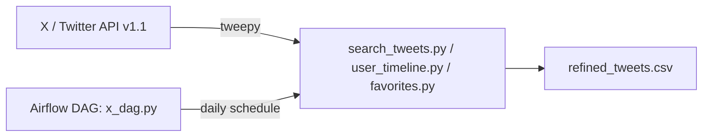

# X (Twitter) Data Pipeline on Airflow

A self-hosted Airflow deployment (via the official `docker-compose.yaml`) that pulls tweets through the X/Twitter API v1.1 and writes them to CSV. Three interchangeable extract scripts cover the three access patterns tweepy exposes: search, a user's timeline, and a user's liked tweets.



## How it works

- `search_tweets.py` — searches tweets matching a query (`SEARCH_QUERY` env var, defaults to `from:twitterdev`), writes `refined_tweets.csv`.
- `user_timeline.py` — pulls a given account's timeline (`SCREEN_NAME` env var), writes `refined_tweets.csv`.
- `favorites.py` — pulls the authenticated user's liked tweets, writes `favorites_tweets.csv`.
- `dags/x_dag.py` — schedules `search_tweets.run_twitter_etl` to run daily via Airflow.

All three scripts share the same OAuth 1.0a flow (`CONSUMER_KEY`/`CONSUMER_SECRET` + `AUTHENTICATION_TOKEN`/`AUTHENTICATION_SECRET`), loaded from a `.env` file.

## Running it

```bash
python3 -m venv venv && source venv/bin/activate
pip install -r requirements.txt

cat <<EOF > .env
CONSUMER_KEY=...
CONSUMER_SECRET=...
AUTHENTICATION_TOKEN=...
AUTHENTICATION_SECRET=...
EOF

python dags/search_tweets.py
```

### Running on Airflow

```bash
mkdir -p ./dags ./logs ./plugins ./config
echo -e "AIRFLOW_UID=$(id -u)\nAIRFLOW_GID=0" > .env
docker compose up -d
```

Airflow UI at `http://localhost:8080` (default credentials `airflow` / `airflow`).

## A note on the X API

Since 2023, X's v1.1 endpoints (the ones tweepy's `search_tweets`, `user_timeline`, and `favorites` wrap) require a paid API tier — they're no longer available on the free plan. The code here is correct against the API contract; running it end to end now depends on your access level.

## Stack

tweepy · pandas · Airflow (CeleryExecutor, Docker Compose) · python-dotenv
