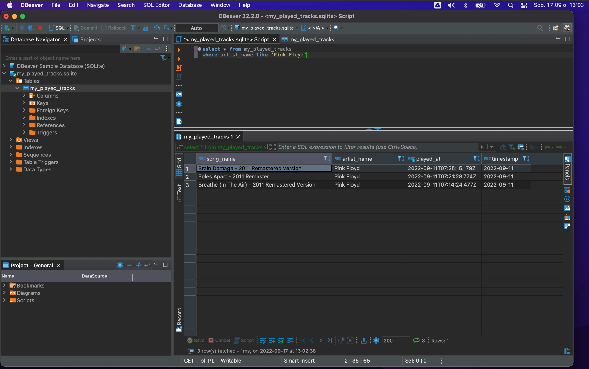

# Spotify Listening History → SQLite

A small ELT pipeline that pulls yesterday's recently-played tracks from the Spotify API and appends them to a local SQLite database, deduplicated on `played_at`. Kept as four numbered scripts on purpose — each one is a complete, runnable snapshot of the pipeline at a stage of development, extract → parse → validate → load, rather than a single final script with the history thrown away.

| Script | Adds |
|---|---|
| `api_extract_version_1.py` | Raw API call, prints the JSON response |
| `api_extract_version_2.py` | Parses the response into a pandas DataFrame |
| `api_transform_version_3.py` | Adds `check_if_valid_data()`: empty-check, primary-key uniqueness, null-check, date-window warning |
| `api_load_version_4.py` | Wires the validation into the run and appends new rows to SQLite |



## Running it

```bash
pip install -r requirements.txt

export SPOTIFY_TOKEN=your_spotify_access_token
export SPOTIFY_USER_ID=your_spotify_user_id
python api_load_version_4.py
```

`SPOTIFY_TOKEN` is a short-lived OAuth access token from the [Spotify Web API](https://developer.spotify.com/documentation/web-api) (`user-read-recently-played` scope) — token refresh isn't implemented here, so it needs to be re-issued periodically for scheduled runs.

## Stack

Spotify Web API · pandas · SQLAlchemy · SQLite
