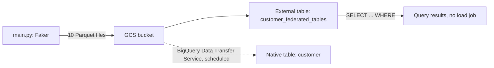

# File-Based CDC via BigQuery External Tables

A pattern for querying newly-arrived Parquet files in GCS the moment they land, without waiting on a scheduled BigQuery Data Transfer Service load — by querying them as an external table first, then promoting to a native table as a separate step.



## How it works

1. **Generate** (`main.py`) — creates 10 batches of synthetic customer records with Faker, writes each as a Parquet file to GCS (simulating files arriving incrementally, as a CDC export would).
2. **Query immediately** (`create_federated_tables.sql`, `customer_federated_tables.sql`) — an [external table](https://cloud.google.com/bigquery/docs/external-data-cloud-storage) over the GCS Parquet files lets you query the data as soon as it lands, with no load step. `customer_federated_tables.sql` filters customers born in the last 30 years directly against the external table.
3. **Promote to native** (`customer.sql`) — defines the destination native table that the BigQuery Data Transfer Service loads into on its own schedule, for workloads that need native-table performance instead of querying external files directly.

## Why this pattern

Native-table loads via the Data Transfer Service run on a schedule (minimum every 15 minutes) — external tables close that gap for cases where a scheduled load isn't fast enough, at the cost of somewhat slower query performance than a native table.

## Running it

```bash
pip install -r requirements.txt

source env.sh  # set GOOGLE_APPLICATION_CREDENTIALS and BUCKET_NAME first
python main.py

bq query --use_legacy_sql=false < create_federated_tables.sql
bq query --use_legacy_sql=false < customer_federated_tables.sql
```

## Stack

Faker · PyArrow · Google Cloud Storage · BigQuery (external tables, Data Transfer Service)
